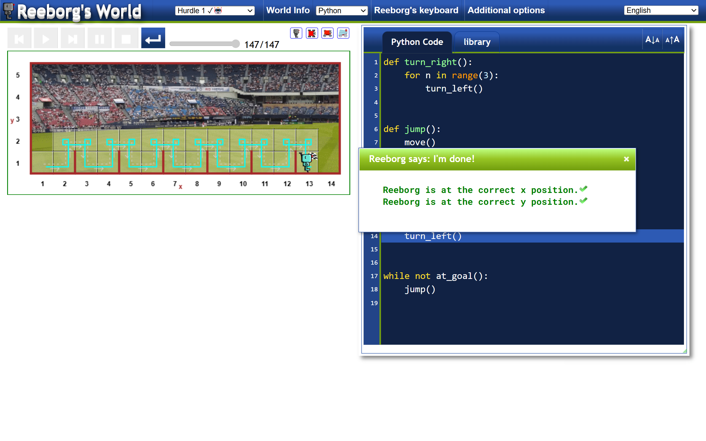
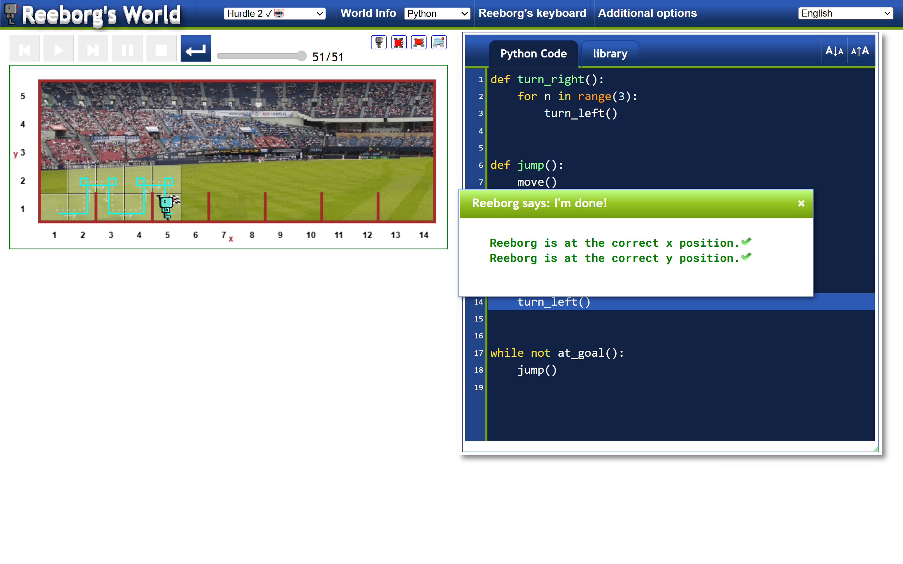
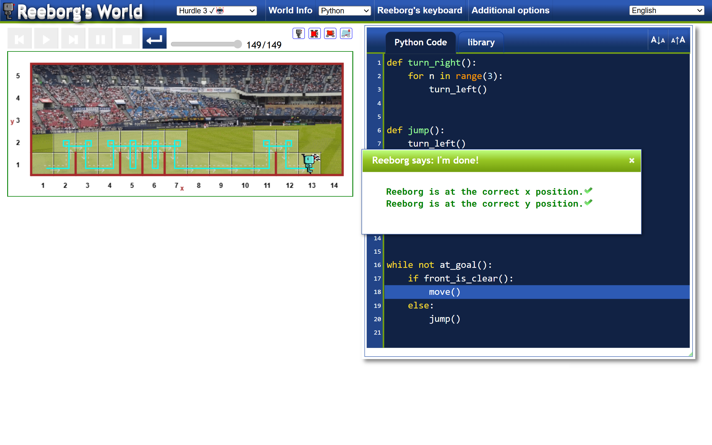
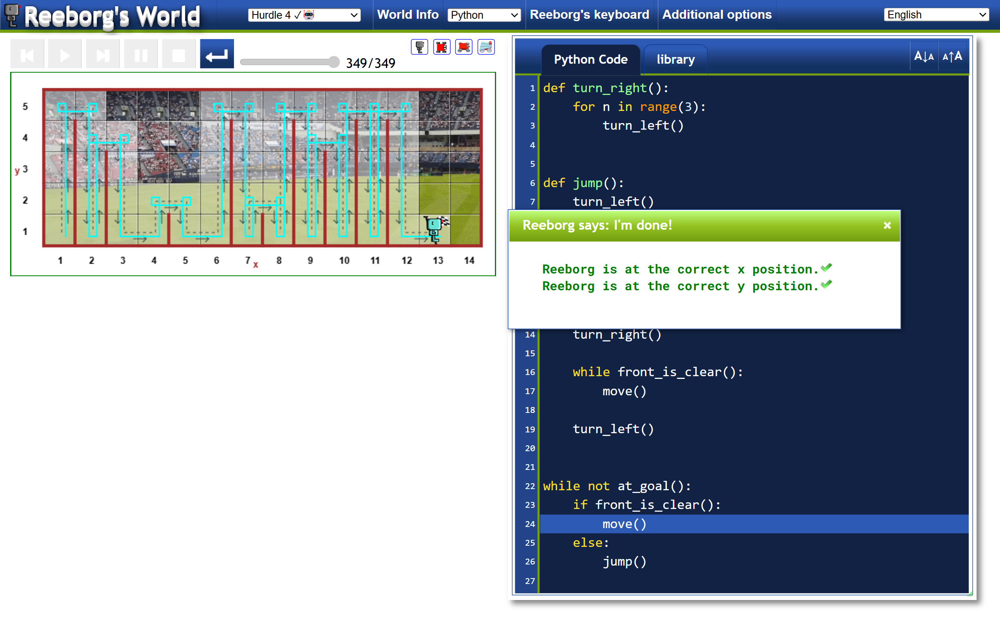
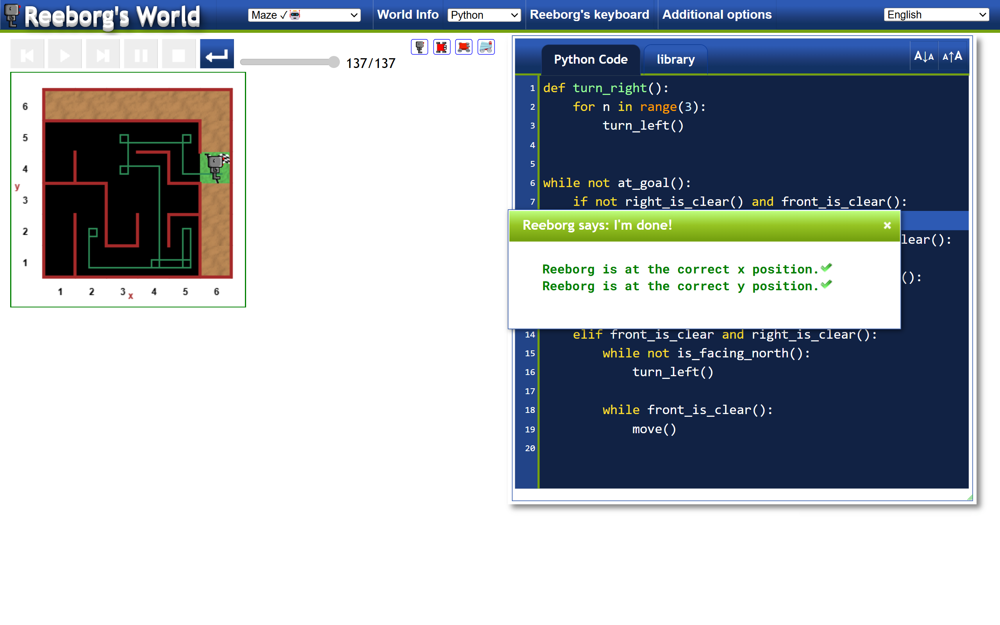

# Reeborg's World Solutions

This repository contains my solutions to various challenges in Reeborg's World. Reeborg's World is an interactive coding platform that helps you learn programming concepts by solving challenges with a robot named Reeborg. Each solution is implemented in Python and is tailored to meet the requirements of the specific challenge.

## Table of Contents

- [Hurdle 1](#hurdle-1)
- [Hurdle 2](#hurdle-2)
- [Hurdle 3](#hurdle-3)
- [Hurdle 4](#hurdle-4)
- [Maze](#maze)

## Hurdle 1

Reeborg needs to jump over a single hurdle and move towards the goal.

```python
def turn_right():
    for n in range(3):
        turn_left()

def jump():
    move()
    turn_left()
    move()
    turn_right()
    move()
    turn_right()
    move()
    turn_left()

while not at_goal():
    jump()
```


## Hurdle 2

Reeborg needs to jump over multiple hurdles of the same height.

```python
def turn_right():
    for n in range(3):
        turn_left()

def jump():
    move()
    turn_left()
    move()
    turn_right()
    move()
    turn_right()
    move()
    turn_left()

while not at_goal():
    jump()
```


## Hurdle 3

Reeborg needs to jump over multiple hurdles of varying heights.

```python
def turn_right():
    for n in range(3):
        turn_left()

def jump():
    turn_left()
    move()
    turn_right()
    move()
    turn_right()
    move()
    turn_left()

while not at_goal():
    if front_is_clear():
        move()
    else:
        jump()
```


## Hurdle 4

Reeborg needs to jump over multiple hurdles of varying heights and distances.

```python
def turn_right():
    for n in range(3):
        turn_left()

def jump():
    turn_left()
    while not right_is_clear():
        move()
    turn_right()
    move()
    turn_right()
    while front_is_clear():
        move()
    turn_left()

while not at_goal():
    if front_is_clear():
        move()
    else:
        jump()
```


## Maze

Reeborg needs to navigate through a maze to reach the goal.

```python
def turn_right():
    for n in range(3):
        turn_left()

while not at_goal():
    if not right_is_clear() and front_is_clear():
        move()
    elif not right_is_clear() and not front_is_clear():
        turn_left()
    elif right_is_clear() and not front_is_clear():
        turn_right()
        move()
    elif front_is_clear and right_is_clear():
        while not is_facing_north():
            turn_left()
        while front_is_clear():
            move()
```


## Contributing

Feel free to contribute to this repository by submitting pull requests or opening issues. Any improvements or additional solutions are welcome!

## License

This project is licensed under the MIT License - see the [LICENSE](LICENSE) file for details.

---

Happy coding with Reeborg!